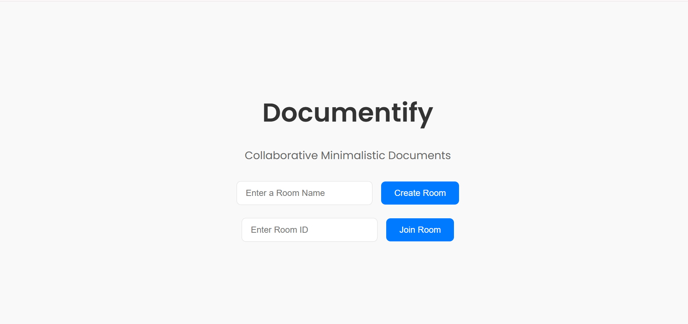
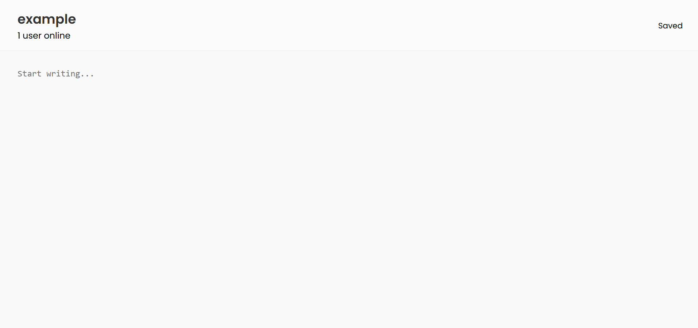

# Documentify 📝

Minimalist real-time collaborative document editor — built from scratch.  
Create rooms, collaborate instantly with others, and auto-save your work effortlessly.

---

## 🌐 Live Demo

👉 [Visit Documentify](https://documentify-vdh1.vercel.app/)

---

## ✨ Features

- 🔥 Real-time collaboration using **Socket.IO**
- 💬 Live editing with multiple users
- 📄 Create or join document "rooms" instantly
- 🧠 Smart autosave after inactivity (no spam saves)
- 🎯 Modern minimalist design (React)
- 🗄️ MongoDB database backend
- 🚀 Deployed on **Vercel** (frontend) and **Render** (backend)

---

## 🖼️ Screenshots

### 🏠 Home Page

> _Create or join a room in seconds._



---

### 📝 Document Editor

> _Real-time document collaboration, auto-saving, and user count display._



---

## 🏗️ Tech Stack

| Layer | Tech |
|:---|:---|
| Frontend | React, Axios, Socket.IO-client |
| Backend | Node.js, Express, Socket.IO-server, Mongoose |
| Database | MongoDB Atlas |
| Deployment | Vercel (frontend), Render (backend) |

---

## 🛠️ Local Development

To run locally:

```bash
# Clone the repo
git clone https://github.com/your-username/documentify.git

# Install dependencies for backend
cd documentify-server
npm install

# Install dependencies for frontend
cd ../documentify-client
npm install

# Start backend
cd ../documentify-server
npm start

# Start frontend
cd ../documentify-client
npm start
